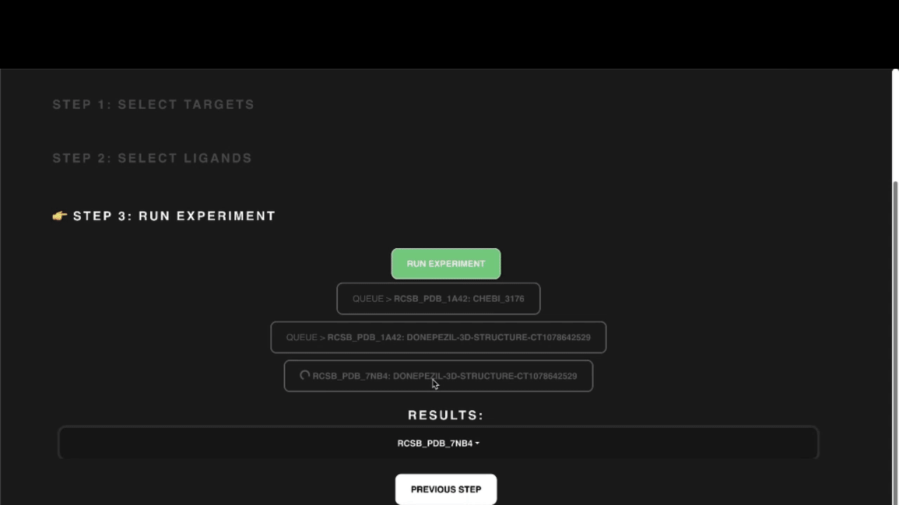

<div align="center" id="top"> 
  

  &#xa0;

  <!-- <a href="https://nolabs.netlify.app">Demo</a> -->
</div>

<h1 align="center">NoLabs</h1>
<h2 align="center">Open source biolab</h2>

<p align="center">
  

  

  

  

  <!--  -->

  <!--  -->

  <!--  -->
</p>

<!-- Status -->

<!-- <h4 align="center"> 
	🚧  NoLabs 🚀 Under construction...  🚧
</h4> 

<hr> -->

<p align="center">
  <a href="#dart-about">About</a> &#xa0; | &#xa0; 
  <a href="#sparkles-features">Features</a> &#xa0; | &#xa0;
  <a href="#rocket-technologies">Technologies</a> &#xa0; | &#xa0;
  <a href="#white_check_mark-requirements">Requirements</a> &#xa0; | &#xa0;
  <a href="#checkered_flag-starting">Starting</a> &#xa0; | &#xa0;
  <a href="#memo-license">License</a> &#xa0; | &#xa0;
  <a href="https://github.com/BasedLabs" target="_blank">Author</a>
</p>

<br>

## About ##

NoLabs is an open source biolab with support of web visualisation and hosting.

The goal of the project is to accelerate bio research via making inference models easy to use for everyone. We are currenly supporting protein biolab (predicting useful protein properties such as solubility, localisation, Gene ontology, folding etc.) and drug discovery biolab (construct ligands and test binding to target proteins). 

We are working on expanding both and adding a cell biolab and genetic biolab, and we will appreciate your support and contributions. Let's accelerate bio research!


## Features ##

**Drug discovery biolab (State of the art):**
1) Drug-target interaction prediction, high throughput virtual screening (HTVS) based on [uMol](https://github.com/patrickbryant1/Umol)
2) Automatic pocket prediction via [P2Rank](https://github.com/rdk/p2rank)
3) Automatic MSA generation via [HH-suite3](https://github.com/soedinglab/hh-suite)



**Protein biolab:**

1) Prediction of subcellular localisation via fine-tuned [ritakurban/ESM_protein_localization](https://huggingface.co/ritakurban/ESM_protein_localization) model (to be updated with a better model)
2) Prediction of folded structure via [facebook/esmfold_v1](https://huggingface.co/facebook/esmfold_v1)
3) Gene ontology prediction for 200 most popular gene ontologies
4) Protein solubility prediction

**Protein Design Lab:**
1) Protein generation via [RFDiffusion](https://github.com/RosettaCommons/RFdiffusion)


**Conformations Lab:**
1) Conformations via [OpenMM](https://github.com/openmm/openmm) and [GROMACS](https://github.com/gromacs/gromacs) 


Hosting:
1) Docker containerisation for easy hosting

## Starting ##

```bash
# Clone this project
$ git clone https://github.com/BasedLabs/nolabs

$ docker compose up

# Or if you want to run single feature run
$ docker compose -up nolabs [gene_ontology|localisation|protein_design|solubility|conformations]

# Server will be available on http://localhost:9000
```

## Technologies ##

The following tools were used in this project:

- [Pytorch](https://pytorch.org/)
- [Jax](https://jax.readthedocs.io/en/latest/index.html)
- [Transformers](https://huggingface.co/transformers)
- [FastAPI](https://pypi.org/project/Flask/)
- [Docker](https://www.docker.com/)

## Requirements ##

**[Recommended for laptops]** If you are using a laptop, use ```--test``` argument (no need to have a lot of compute):
- RAM > 16GB
- [Optional] GPU memory >= 16GB (REALLY speeds up the inference)

**[Recommended for powerful workstations]** Else, if you want to host everything on your machine and have faster inference:
- RAM > 30GB
- [Optional] GPU memory >= 40GB (REALLY speeds up the inference)

## :memo: License ##

This project is under license from MIT. For more details, see the [LICENSE](LICENSE.md) file.


Made by <a href="https://github.com/jaktenstid" target="_blank">Igor</a> and <a href="https://github.com/timurishmuratov7" target="_blank">Tim</a>

&#xa0;

<a href="#top">Back to top</a>
