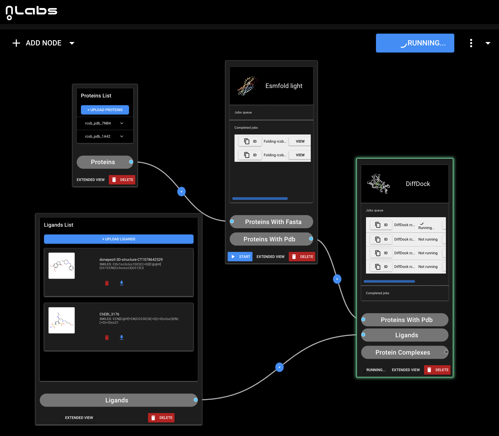

#### **Workflow overview**
NoLabs is an open-source platform designed for collaborative bioinformatics research and AI model inference. A key feature of NoLabs is its workflow engine, which allows the creation and orchestration of Python components into directed acyclic graphs (DAGs). These components and inner component jobs can run parallel jobs on distributed clusters, such as Kubernetes (k8s), utilizing containerized environments.

### **Workflow engine RFC**

---

### **Workflow Engine Features**
- **Component Management**:
  - **Python Components**: Create and manage components that can be linked to define execution order and input/output mappings.
  - **DAG Formation**: Combine components into a directed acyclic graph (DAG) to define execution workflows.

- **Jobs Management**:
  - **Parallel Jobs Execution**: Components can generate multiple jobs, each running in parallel on separate machines (e.g., Docker containers) within a distributed cluster.
  - **Job Environment**: Each job can run in a distinct environment, potentially including CUDA, AI models, etc.

- **Example Workflow**:
  - **Proteins List and Ligands List Components**: These data-source components execute first and do not contain any jobs.
  - **Esmfold Light Component**: Receives `.fasta` files from the Proteins List component and generates `N` folding jobs (`N = number of files`).
  - **DiffDock Component**: Receives output from the Ligands List and Esmfold Light components, generating `K` jobs (`K = number of protein files * number of ligand files`) to perform molecule-protein binding.



---

### **Requirements**

#### **Functional Requirements**
1. **Input/Output Mapping**:
   - Map component inputs and outputs (already implemented in the workflow engine).
   - Validate inputs and outputs to ensure correct execution (implemented in the workflow engine).

2. **Job Parallelization**:
   - Jobs should be parallelized across multiple machines in a cluster (1 job per machine).
   - Jobs can run in containers with specific environments, including CUDA, AI models, etc.
   - Specific jobs should be executed only in containers of a designated type.

3. **Components and jobs Execution and Monitoring**:
   - **Logging**: Collect logs from components and jobs.
   - **Error Handling**: Stop further execution in the DAG if a previous component fails.
   - **Component Monitoring**: Monitor the status of component and inner jobs, with capabilities to stop or start individual components.
   - **Timeout Management**: Implement execution timeouts for components.

4. **Job Execution Types**:
   - Support different task types running in containers of different types (e.g., one container might lack certain dependencies).

5. **Inter-Component Communication**:
   - Use MongoDB for communication between components and tasks, providing a flexible way to pass large datasets.

#### **Non-Functional Requirements**
- **Scalability**: Support for running tasks in a distributed, scalable cluster environment.
- **Flexibility**: Ability to manage and customize workflows and environments dynamically.
- **Reliability**: Ensure task execution with robust error handling and monitoring capabilities.
- **Community and Support**: Leverage a large community with open-source licensing.

---

### **Suggested Approach**

#### **Execution Framework**
- **Apache Airflow**:
  - **Pros**:
    - Large community support.
    - Open-source license.
    - Flexibility in managing workflows and tasks.
  - **Cons**:
    - Complexity in setup and configuration.
    - Limited support for Dynamic DAGs.

#### **Custom Workflow Engine**
- **Purpose**: Acts as a facade for Airflow operators, validating mappings and ensuring input/output correctness.
- **Task Modules**:
  - **Structure**:
    - Each task is encapsulated in a separate module.
    - The module includes:
      - `pyproject.toml`
      - `Dockerfile` for creating the task environment (including Apache Airflow Celery worker).
      - Python code that extends `ExecuteJobOperator` from the main project.
  - **Execution**:
    - The task module's code is executed in a separate container, isolated from the main project.

- **Pros**:
  - Clear separation of responsibilities and environments.
- **Cons**:
  - Requires managing multiple subprojects with separate Docker containers.
  - Import complexities due to the need to avoid non-existent modules in the root project.

#### **Component Classes**
Each component consists of three operators. Component operators must inherit these three classes and override ```async def execute_async``` function that contains code.

- **SetupOperator**:
  - Initializes tasks and returns an array of task identifiers. It runs in the main application container.

- **ExecuteJobOperator**:
  - Contains code that will be executed in separate container.
  - Example code showing how to define a task operator that inherits from `ExecuteJobOperator` and overrides `execute_async`.
  - Imports must be done within functions to avoid issues with non-existent modules in the main project.
```
from typing import Any
from airflow.utils.context import Context
from nolabs.application.workflow import ExecuteJobOperator

class RunEsmFoldLightOperator(ExecuteJobOperator):
   async def execute_async(self, context: Context) -> Any:
       import requests
       from nolabs.job_services.esmfold_light.container.api_models import PredictFoldingJobRequest, PredictFoldingJobResponse


       input = PredictFoldingJobRequest(**self.get_input())


       url = "https://api.esmatlas.com/foldSequence/v1/pdb/"
       response = requests.post(url, data=input.protein_sequence, verify=False)


       self.set_output(PredictFoldingJobResponse(pdb_content=response.text))
```
  
- **OutputOperator**
  - Gathers and reduces task results, setting component output parameters. It also runs in the main application container.

---

### **Inter-Component Communication**
- **Communicator Class**:
  - Represents a MongoDB document.
  - Stores input and output data for tasks.
- **Pros**:
  - Greater flexibility in managing communication between operators.
  - Ability to pass large datasets efficiently.
- **Cons**:
  - Potential for "hanging" data in case of operator failures.
  - Requires a MongoDB instance.

---

### **Module Structure**
- A visual representation of the module structure can be found at the following link: [Excalidraw Module Structure](https://excalidraw.com/#json=6PiGwXihnpIW2nrrqBovd,KCtWqQOiQtDgVEScL3wDAw).

---

